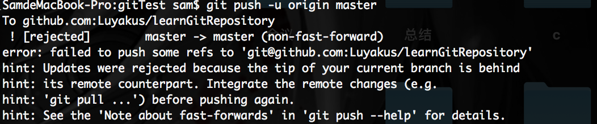

## git 问题总结
### 配置公钥
1. 配置用户名: git config user.name [用户名]
2. 配置邮箱: git config user.email [邮箱]
> 在 config 后面加上 --global 即可设置全局用户和邮箱 

3. 生成 ssh key: ssh -keygen -t rsa -C [邮箱]
4. 然后在 ~/.ssh 目录下可以看到 id_rsa(私钥) 和 id_rsa.pub(公钥) 两个文件, id_rsa.pub 文件里存放的就是我们要使用的 key
5. 把公钥粘贴到 git 网站上
6. 验证是否成功: ssh -T git@github.com

### 管理多个公钥
1. 配置用户名: git config user.name [用户名]
2. 配置邮箱: git config user.email [邮箱]
3. 在指定文件中生成 ssh key: ssh-keygen -t rsa -f ~/.ssh/[文件名] -C [邮箱]
4. 配置 config 文件: 在 ~/.ssh/ 目录下新建一个 config 文件, 写入以下内容保存
```
Host github.com  // git 网站域名
User 493396157@qq.com // 邮箱 or 用户名
PreferredAuthentications publickey
IdentityFile ~/.ssh/id_rsa // 生成 ssh key 时指定的文件名

```
5. 粘贴 .pub 文件内容到 git 网站
6. 验证: ssh -T git@[git网站域名]

### 在 github 上生成一个仓库添加到本地仓库, push 的时候 出现 
1. 遇到这个问题是因为在 github 上生成仓库的时候勾选在创建README.md文件的按钮创建了说明文档，但是却没有pull到本地。这样就产生了版本冲突的问题
2. 因此要先将 repo pull 下来 git pull origin master --allow-unrelated-histories
3. 再 git push -u origin master

