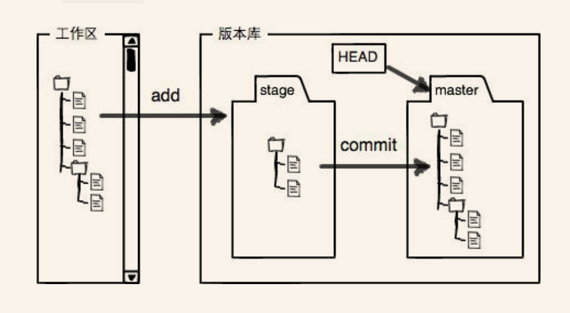

## git 总结
### 初始化 git 仓库

1. git init
2. 用 ls -ah, 可以查看文件夹里所有隐藏文件

### 查看文件状态
1. git status
2. git diff [文件名]

### 提交文件
1. git add [文件名]
2. git commit -m "描述信息"

### 版本回退
1. git log 查看版本信息
2. 版本回退的几种方式 \
    2.1 回退到上个版本 git reset --hard HEAD^ \
    2.2 回退到上上个版本 git reset --hard HEAD^^ \
    2.3 回退到指定版本 git reset --hard HEAD~N \
    2.3 回退到制定版本号 git reset --hard [版本号] 
    2.4 回退到指定提交记录号 git reflog 查看提交记录 
    2.5 回退到指定提交记录号 git reset --hard [提交记录号] 
3. git 内部有个指向当前版本的 HEAD 指针, 回退的时候仅仅是把 HEAD 指针指向指定的版本, 然后更新工作区文件

### 工作区和暂存区
1. 工作区就是当前文件放的目录
2. 版本库 .git \
    2.1 .git 里放了很多东西, 最重要的是称为 stage 的暂存区 \
    2.2 还有 git 为我们自动创建的第一个分支 master, 以及指向 master 的一个指针 HEAD
     
3. 把文件往 git 版本库里添加的时候是分两步执行的 \
    3.1 用 git add 把文件添加进去, 实际上就是把文件修改添加到暂存区\
    3.2 用 git commit 提交更改, 实际上就是把暂存区所有内容提交到当前分支 \

### 管理修改
1. git 不是追踪文件, 而是追踪修改
2. 提交修改
    2.1 每次修改，如果不add到暂存区，那就不会加入到commit中
3. 撤销修改
    3.1 撤销工作区修改, 

